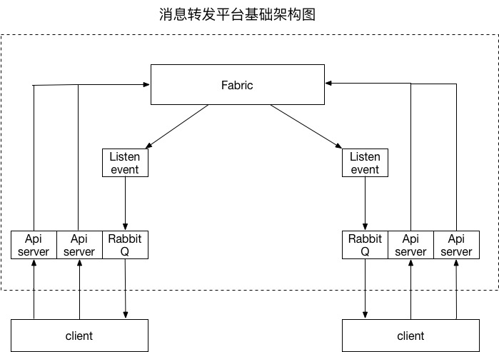

# 消息转发平台设计

## 基础部分

### 主要需求
* SaveData()接口以及执行结果通知和接收人通知
* 链上数据支持DSL查询
* 可以获取Fabric原始的区块信息
* Event可靠性保证
* 兼容信用证业务（指定下一笔交易发起人）

### 架构设计

##### 架构图

* Fabric 本身还是采用原有的架构
* Chaincode 模块
* ListenEvent 模块
* ApiServer 模块(主备节点)
* RabbitQ 模块

### 交易流程
1. 链上做交易的每个用户都要有自己的唯一用户id，并且要有自己的一套证书。
2. `client_sdk.yaml`中要配置上自己的用户id，以及证书的跟路径，证书存放路径示例：

> /xxx/certs/self/AAA   # 自己证书路径，ABC为自己的用户ID  
> /xxx/certs/others/BBB # BBB的证书路径  
> /xxx/certs/others/CCC # CCC的证书路径

3. 前端发消息报文到api，api对sender做验证，解析报文，然后根据相应结果做加密
4. 加密之后填充keys字段，将报文通过invoke调用发送给cc
5. cc保存消息数据，发布event通知sdk
6. sdk解析event，根据需要解析报文数据将消息发送给RabbitQ

### 数据结构

Field          |  Type     | description
---------------|-----------|-------------
createBy       | String    | 创建者
createTime     | UINT64    | 创建时间
sender         | String    | 发送者
receiver       | []String  | 接收者列表
txData         | String    | 业务数据
lastUpdateTime | UINT64    | 最近一次修改时间
lastUpdateBy   | String    | 最近一次修改者
cryptoFlag     | INT       | 加密标识（0:不加密，1:加密）
cryptoAlgorithm | String | 加密算法类型
docType        | String    | 业务类型
fabricTxId     | String    | Fabric交易id(uuid)
businessNo     | String    | 业务编号（交易编号）
               |           |
keys           | []String  | 用receiver证书加密后的密钥
rootId         | String    | 系列交易id
nextSenderCerts | []String  | 下一笔交易发起人的证书
sendTime       | UINT64    | 发送时间
senderCert     | String    | 发送人证书
sign           | String    | 发送者签名

### api_server/sdk 设计

1. api\_server接受到报文以后将报文解析，获取是否加密和加密算法类型
2. 如果需要加密则sdk生成随机秘钥对业务数据(txData)对称加密（采用报文指定的加密算法），然后在本地crypto目录下找出接收者的公钥对随机秘钥非对称加密，将生成的加密后的随机秘钥列表依次放入到报文的keys字段中
3. 将报文数据拼接成 （key: txid, value: 报文json ）的数据结构,然后通过invoke接口调用发送给peer。
4. chaincode 接收到saveData数据后直接根据key，value存储数据，然后发出event
5. sdk接受到block\_event后,解析其中的交易，对比交易中的receiver是否为自己的id，如果是自己的id，将其中的keys用自己的私钥解密，然后解出txdata，然后返给api_server。

### chaincode 设计

chaincode 主要为2个接口，SaveData()和DslQuery()

* SaveData
	* 用SenderCert验证sign
	* 根据rootId取出nextSenderCerts
	* 判断senderCert是否在nextSenderCerts中
	* putState并更新nextSenderCerts
	* 发送Event通知
* DslQuery
	* 调用CouchDB查询并返回结果
	
### 可靠性保证

##### api_server/sdk 可靠性保证
1. sdk本地保存接收到的blockEvent 区块高度
2. sdk每次收到blockEvent与本地区块高度对比验证是否有丢失blockevent的情况
3. sdk重启或网络重连时到peer获取下当前区块高度与本地区块高度对比，如果sdk少了一些区块则调用qscc一次获取遗漏的区块，并通过event通知client

##### api_server到client可靠性保证
1. api_server与前端消息通知的可靠性通过RabbitQ保证

### 信用证业务(指定下一笔交易发起人）

信用证业务需要在原有报文的基础上增加两个字段，`rootId`和`nextSenderCerts`

Field | value |||||
------------|-----------|----------|-----------------|-------|----------
rootId      | nil       |    nil   |  !nil           | !nil  | !nil
nextSenderCerts  | !nil     |    nil   |  !nil           | $all  |  nil
交易类型    | 系列交易第一笔 | 普通交易 | 指定下一笔操作人| 所有人都可以发起下一笔|  最后一笔

##### 信用证业务需要在通用的消息转发平台基础上做额外处理
1. api_server 在接收到原始报文之后，对报文增加两个字段`rootId`和`nextSenderCerts `，由于目前保理项目没有这个需求，所以这两个字段可以一致为空
1. chaincode 根据报文参数里 rootId与nextSenderCerts字段value是否同时为空来判断是否为普通消息转发交易还是信用证消息交易
2. 如果为信用证消息类型，则需要根据具体的rootId值和nextSenderCerts来判断具体的交易类型
3. 系统第一笔交易：cc将fabricTxId 赋值给rootId 并存储到链(key:rootId, value: nextSenderCerts)
4. 指定下一笔操作人：cc根据rootId读取原有的nextSender记录，判断当前sender是否为有效，并更新nextSenderCerts
5. 所有人：当nextSenderCerts字段保存的为 `$all` 时
6. 最后一笔：nextSenderCerts为空，则任何人用此`rootId`做下一笔交易都被判断为非法

### 其他

1. 由于sender也存在查询自己传入的需要加密的数据，所以当需要加密报文数据时需要在keys中再添加sender相应的key(放置最后一个)
2. 由于chaincode不对身份做硬性验证，只做字符串级别（通过用户名）的验证，所以sdk要保证报文中的sender与sdk本地默认的操作用户对应，如果不对应sdk直接报错（此验证可以加上根证书验证）
3. sdk操作用户的配置通过client_sdk.yaml文件来配置用户id和证书路径cryptoPath

## 升级部分

### apiServer, ListenEvent封装docker镜像

### sdk与apiServer支持MySQL本地存储

### kafka作为消息转发的中间件
